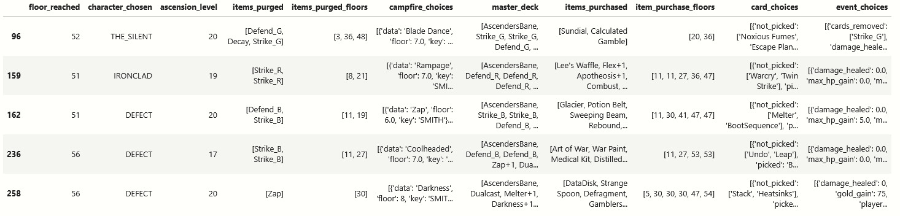
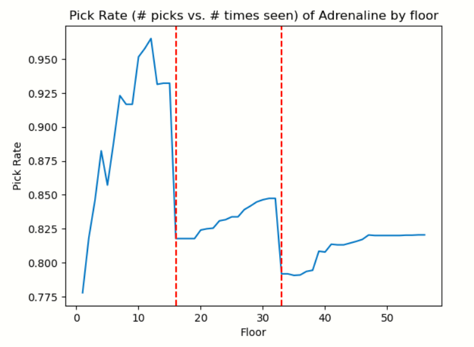
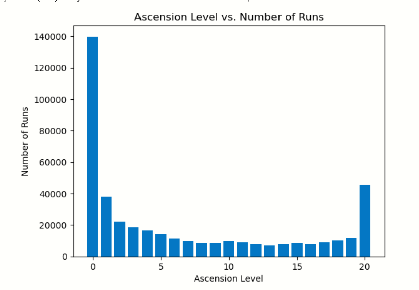
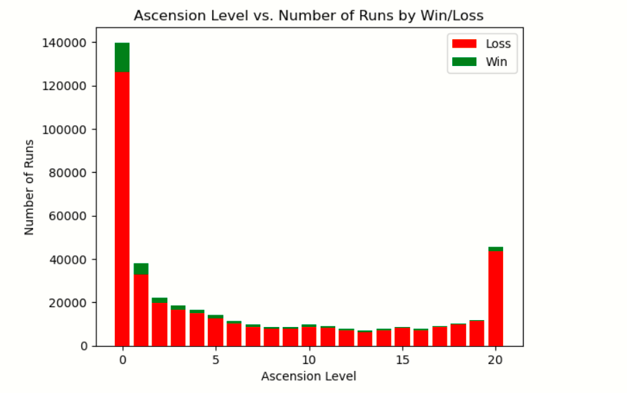

### Dataset Selection

For the project, I plan to use a dataset of runs of the deckbuilder game Slay the Spire. One of the primary systems in this game is the choice of one of three cards to add to your deck at the end of each fight, and my end goal is to create a recommender for which card to pick out of those three.

I have two data sets I'm working with:
- My own personal Slay the Spire runs. There are about 500 of these. I plan to use this data set primarily to have a smaller set to develop and demonstrate the model with, and to see if I can extract any meaningful trends from my own playstyle.
- A data set of 77 million runs, made available by the developers of the game in the Slay the Spire discord server. I have a subset of about 422,000 of these runs that I'll be using later for model training.

Each run in the data is formatted as a `json` file, with many of the columns containing dictionaries or lists. This makes sense, as the history of each run is stored as a set of events, with the events being categorized into what kind of event they are, then labelled with the floor they took place on. This'll allow us to determine the state of a run's deck at any given floor, later on.

This data is relevant to this project because card choices in Slay the Spire is rarely subjective. The best way to determine which card is best in any given situation is to have prior experience with similar situations, and so the model will use the information it has on similar situations that have occurred before to determine what card choices will be good.

### EDA & Data Cleaning

Since we only care about recommending cards, I only selected columns that contained information about when cards were added, removed, or upgraded. After that, the data looked like this:

There were a couple of columns, for example `items_purged` and `items_purged_floors`, that could have been combined into a single colum containing both when cards were removed and what card. The column `card_choices` was also in a different format than what I wanted, so I reformatted it to only contain what card was chosen at each floor.

While doing my data reformatting, I decided to visualize the pick rate by floor of the card **Adrenaline**. This is a rare card, and I chose to visualize it specifically because it's one of the cards that has virtually no downsides, other than the opportunity cost of taking another card. What I saw in this visualization interested me:

At first, I was confused by the sudden drops around floors 16 and 33. However, there's a simple explanation for this. Those floors (signified by the red lines) are the Act 1 and Act 2 boss floors, and each boss gives a choice between three rare cards rather than the usual three random cards. Now that **Adrenaline** is being compared to other rare cards rather than common and uncommon cards, it has a much higher opportunity cost and so its pick rate drops. This is something to keep in mind for all rare cards, that they'll need to be compared to other rare cards twice a run.

Another thing to keep in mind is how few runs there are on high difficulty (Ascension 17+). Runs on low Ascension are not useful, as they don't signify any kind of skill or game knowledge, and we want data that actually shows us which card choices are good. This means our 422,000 runs are likely getting filtered down to only a few thousand, as seen in this visualization:

Approximately 1/3 of runs are done on Ascension 0, with only about 1/8 being on Ascension 20. It gets even worse when you look at the wins on each difficulty:

If we want to only use good runs, we'll either have to gather a whole lot more data or redefine what we consider to be a "good" run. Fortunately I'm only using 0.5% of the available data currently, so there's plenty of room to improve on that front.

Unfortunately, there are a bunch of issues with the data that stop me from identifying any more trends. The main one is that the data is just not formatted well for this kind of project, which is something I'm still working on. The other issue is that the only features I'm using are card picks, and it's difficult to draw many conclusions about correlations of features at the moment.