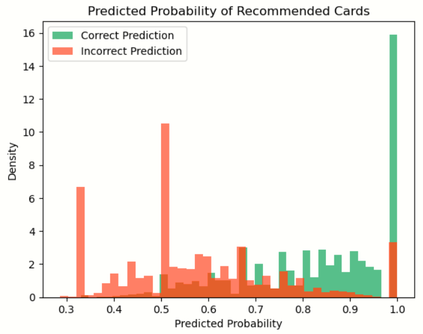
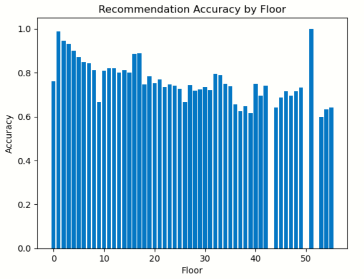

# Slay the Spire Card Recommender
Author: Charlie Jansen

## Intro
Slay the Spire is a deckbuilder roguelike video game that revolves around choosing one of three random cards from card rewards, crafting a deck designed to beat whatever challenges the game might throw at you. The basic mechanics of the game are relatively easy to understand, but making card choices takes hundreds or even thousands of hours to become good at. The answer to the question "which of these cards is better" is almost always "it depends," and my goal was to create a tool that would give people, especially new players, an answer to that question.

## The Data
The primary data set I used was a data set of around 77,000,000 runs made public by the developers of Slay the Spire, available on the game's Discord server. Of these 77 million runs, I downloaded about 422,000 of them, then filtered them to only include runs that went far into the game and were done on high difficulties. This would mean that the cards being chosen, and decisions being made, were relatively good decisions being made by relatively good players. After filtering I ended up with around 6,700 runs, and set aside about 1,400 as a test set.

In order to make the data usable, I processed it into a couple different forms. The format that was the most useful to me was a set of 47 DataFrames, one for each floor from 0 to 46, containing the cards that each run had in its deck at that floor. I also filled every card that the deck did not contain with a -5, as I wanted there to be a larger difference between a deck that did not contain a card and a deck that contained one, than between a deck with one of a card and a deck with two.

## The Models
First, I decided that my metric of choice for these models would be accuracy. With only three options (most of the time) to choose from, and the goal of selecting the correct option out of the three, accuracy gave me a very strong measure of how well our model was performing.

I first started by creating a few heuristic models. Of these, the most notable was a model that recommended the card that had the highest pick rate (number of times selected / number of times offered) at the current floor. The other two heuristic models performed worse, so they're not too worth talking about.

I also created a random baseline, to be used to compare our other models to. I expected this random baseline to have an accuracy of 0.33, since it has a 1 in 3 chance of guessing correctly.

Finally, I created an actual model using NearestNeighbors and the deck states data from earlier. For this model, I would take the deck state of the current run and get the 20 most similar deck states in the training data, then determine which card those 20 runs chose the most often in the next few floors. This model was the only one that actually took deck state into account, so I expected it to make the correct prediction in the most situations.

|Model|Type|Accuracy|
|:-:|:-:|:-:|
|Random|Random|0.27|
|Pick Rate|Heuristic|0.49|
|Deck States|NearestNeighbors|0.79|

As we can see, the deck states NearestNeighbors model performed significantly better than any other option. I believe this to be because it can take into account what situations certain cards get picked in, rather than just recommending whatever is universally good.

## The Best Model
I still wanted to understand a bit more about my best model, to see what it does a good job predicting and what it could improve on.

Each model would output a "confidence" value for each card, representing how likely it is to be the correct choice. I wanted to plot those confidence values for both right and wrong predictions, to see if there was any correlation.

As we can see, cards recommended with a lower confidence are more likely to be incorrect, while cards recommended with a higher confidence are correct more often. If we wanted to improve the model from here, we could add a second model to check the predictions for lower confidence levels.

Additionally, I wanted to quickly check if my accuracies were similar for different colors of cards, to see if it was predicting choices better or worse for certain characters.

|Color|Accuracy|
|:-:|:-:|
|RED|0.80|
|GREEN|0.83|
|BLUE|0.79|
|PURPLE|0.74|

We definitely do make worse predictions for some characters over others. We're still pretty accurate for all four characters though, there's not a huge discrepancy.

Finally, I wanted to see if our predictions were better or worse as we got to higher floors, later into a run.

As we can see in this plot, our recommendations are very good on earlier floors, then get worse as the run goes on. This makes sense to me intuitively, as at the beginning of a run the deck states are almost the exact same, but start to diverge more and more as the runs continue. The accuracy also remains above an acceptable amount even at its worst, so I'm fine with it. This problem could be solved by adding more data to cover more unique situations, at the cost of decreasing prediction speed.