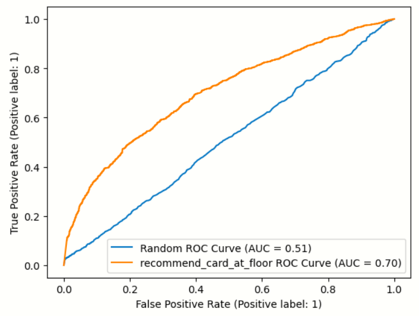

### Modeling and Feature Development

With the Slay the Spire card data set, the features in pretty much every model are going to be the cards (because, what else would they be). However, the ways in which I use them are going to vary from model to model, and that's where my feature engineering comes in.

A lot of the work I've done on the data so far has been reorganizing all of the data into a common format, so that I could create my feature set from there. As of now, I have a DataFrame containing the state of the player's deck at every floor from 0-56 for each run in the dataset. This will allow me to create feature sets based on floors, and use different deck states at different times.

With that, I've only implemented one real model at the moment, a model that recommends the card from the choices that has the highest pickrate by the given floor. This model has some pros and some cons:
- Pros:
    - Very simple
    - Recommends cards based off of how often they're taken when they're offered, so doesn't favor rarer cards excessively
    - Still favors rare and uncommon cards, since they're generally stronger (good)
- Cons:
    - Doesn't take the current deck into account, just recommends what's the best in the most decks
    - Rare cards are almost never competing against each other until floor 16, so their pick rates will be very inflated before that
    - Still favors rare and uncommon cards, since they're generally stronger (bad)

Since a card reward is (almost always) three cards, a random model should recommend correctly 33.3% of the time. My goal by the end of this project is to recommend correctly 80% of the time, so 80% accuracy.

Even though I only have one implemented model so far, I still have plenty of ideas for other models:
- Finding which cards are the most present within decks at a certain floor (technically different from pickrate)
- A simple heuristic of always recommending rare cards over uncommons and always recommending uncommon cards over common cards
    - For this one, a list of all cards is available in the StS Discord, and I can extract card rarities from that
- Potentially even clustering cards based on which decks they're taken in, and modifying earlier models to check whether they took similar cards rather than just the same card

### Model Evaluation

When I designed the model I have, I forgot to set aside data for a train-test split before aggregating. I also did not evaluate on the main data set (lack of time), so we only have the data points from my personal gameplay. So, these metrics should be taken with a grain (or maybe an entire shaker full) of salt. With that aside, here's how the model performed while predicting the training data:

ROC-AUC is not the main metric I'm targeting (that's accuracy), but a ROC-AUC of 0.7 is not bad, at least compared to random. We also got measures for accuracy:

||Random|Model|
|-|:-:|:-:|
|Accuracy|0.31|0.68|

Once again, we're predicting on the training data, but we're already predicting almost 70% of card choices correctly.

I would love to do more work on this right now, especially to implement a train-test split and get actual metrics that I can trust, but unfortunately it is 40 minutes past the deadline and I need to sleep (: